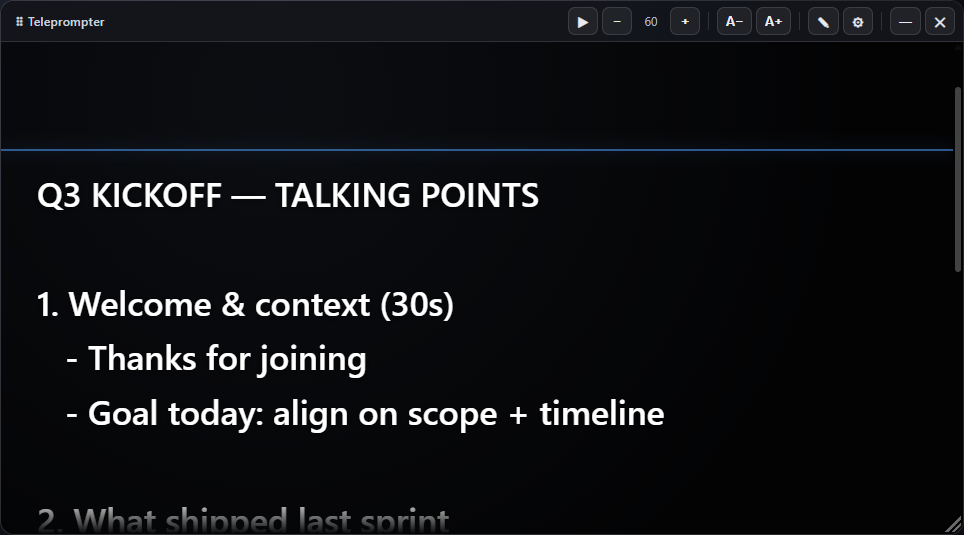

# Teleprompter Overlay

A floating, **always-on-top** teleprompter for Windows. Paste your notes or script, keep them right in front of you while you're on **Google Meet**, Zoom, or anything else — and only you see them.



## Download

Grab the latest build from the [**Releases**](https://github.com/vinicius-p3/teleprompter-overlay/releases/latest) page:

- **Teleprompter Setup x.y.z.exe** — installer (adds a desktop + Start menu shortcut).
- **Teleprompter-portable.exe** — portable, just double-click (no install).

> **First run:** Windows shows a SmartScreen warning because the app isn't code-signed.
> Click **More info → Run anyway**. It's normal for apps without a paid signing
> certificate — not a virus. You can verify the download with the SHA-256 checksums in
> [SECURITY.md](SECURITY.md).

## Features

- **Floats on top of everything** — drag it anywhere, resize it from the bottom-right grip, set how see-through it is.
- **Auto-scroll** with adjustable speed, or scroll manually with the mouse wheel.
- **Backgrounds:** black, white, or transparent, with adjustable opacity.
- **Font size**, line spacing, text color, and an optional reading-line guide.
- **Hide from screen sharing** — if you share your screen, the teleprompter stays invisible to everyone else.
- **Click-through mode** — the text keeps scrolling while your clicks go straight to the meeting behind it.
- **Global shortcuts** that work even when the meeting window is focused.
- Remembers your script and settings automatically.
- **Interface in English, Português, and Español** — auto-detects your system language on first run.

## Usage

1. Click the **✎** button, paste your script, then click **✎** again to switch to reading mode.
2. Press **▶** to auto-scroll, or scroll manually with the mouse wheel (the wheel pauses auto-scroll).
3. Open **⚙** to adjust background, opacity, speed, font, language, and the privacy options.

### Keyboard shortcuts

Global (work even when the meeting is focused):

| Shortcut | Action |
| --- | --- |
| `Ctrl+Alt+Space` | Play / Pause |
| `Ctrl+Alt+↑` / `Ctrl+Alt+↓` | Faster / slower |
| `Ctrl+Alt+R` | Back to the top |
| `Ctrl+Alt+L` | Toggle click-through mode |
| `Ctrl+Alt+H` | Hide / show the overlay |

Inside the window: `Space` play/pause, `+` / `−` font size, `Home` jump to top, `Esc` leave edit mode.

## Run from source

```bash
npm install
npm start
```

## Build the installers

```bash
npm run dist
```

Outputs the installer and portable `.exe` to `dist/` (and regenerates the app icon via `make-icon.js`).

## Security

The app is **100% local**: no network requests, no telemetry, nothing leaves your machine. It's built on Electron with the standard hardening enabled (context isolation, sandbox, restrictive CSP, no remote content) and ships with **zero dependency vulnerabilities**. Full details in [SECURITY.md](SECURITY.md).

## License

[MIT](LICENSE) © Vinícius Bazilio
